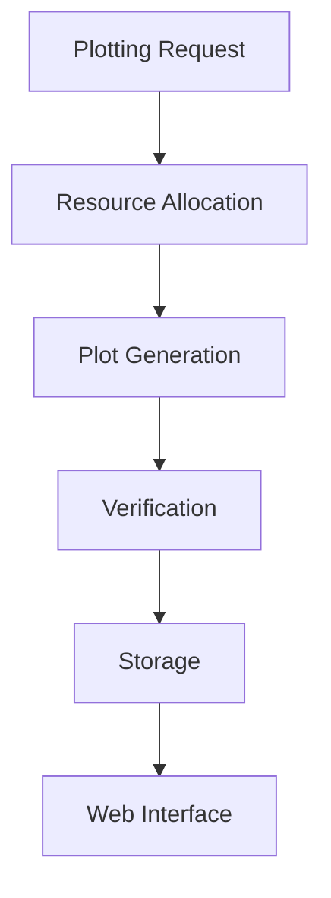

# 🧠 SquashPlot Beta - Chia Plotting Optimization Tool

<div align="center">


**Chia Plotting Optimization Tool - Beta Version**

[🚀 Deploy on Replit](https://replit.com/github/squashplot/squashplot) • [📖 Documentation](https://github.com/squashplot/squashplot/wiki) • [🌐 Live Demo](https://squashplot.replit.dev) • [💬 Discord](https://discord.gg/squashplot)

[](https://www.python.org/)
[](https://opensource.org/licenses/MIT)
[](https://replit.com/github/squashplot/squashplot)
[](https://github.com/squashplot/squashplot)

</div>

---

## 📊 **Overview**

**SquashPlot Beta** is an experimental Chia blockchain farming optimization tool. This beta version provides plotting capabilities with web interface management and research frameworks for Chia farming optimization.

### 🎯 **Beta Features**

<div align="center">

| Feature | Status | Notes |
|---------|--------|--------|
| **Plotting Engine** | ✅ Beta | Chia plotting capabilities |
| **Web Interface** | ✅ Beta | Dashboard and management |
| **CLI Tools** | ✅ Beta | Command-line utilities |
| **Wallet Integration** | ✅ Beta | Chia wallet support |
| **Research Frameworks** | ✅ Beta | Experimental algorithms |
| **Performance Monitoring** | ✅ Beta | Metrics and analytics |
| **GPU Support** | 🚧 Experimental | F2 optimization |

</div>

> **⚠️ Beta Notice**: This is experimental software. Features may change or be removed.

---

## 🚀 **Quick Start**

### **Deploy on Replit (Recommended)**

[](https://replit.com/github/squashplot/squashplot)

```bash
# 1. Click the "Run on Replit" button above
# 2. Wait for dependencies to install
# 3. Click "Open in new tab"
# 4. Start using SquashPlot!
```

### **Local Installation**

```bash
# Clone the repository
git clone https://github.com/squashplot/squashplot.git
cd squashplot

# Install dependencies
pip install -r requirements.txt

# Run setup
python setup.py

# Start web interface
python main.py --web

# Access at: http://localhost:8080
```

### **Test Everything**

```bash
# Run comprehensive tests
python test_squashplot.py

# Benchmark performance
python squashplot.py --benchmark

# Validate compression
python compression_validator.py --size 100
```

---

## 🎛️ **Beta Architecture**

### **Plotting Pipeline**



### **Beta Features**

- **🔬 Experimental Algorithms**: Research-grade plotting optimization
- **🧠 Advanced Mathematics**: Pattern recognition frameworks
- **⚡ GPU Support**: Hardware acceleration (experimental)
- **🔐 Data Integrity**: SHA256 verification for plot validation
- **📊 Real-time Monitoring**: Performance metrics and analytics
- **🔗 Wallet Integration**: Chia wallet connectivity

---

## 📈 **Beta Performance**

### **Current Capabilities**

<div align="center">

| Feature | Status | Notes |
|---------|--------|-------|
| **K-Size Support** | ✅ K-30, K-32, K-34 | Standard Chia plot sizes |
| **Platform Support** | ✅ Windows, Linux, macOS | Cross-platform compatibility |
| **Wallet Integration** | ✅ Chia, Sage, Goby | Multiple wallet support |
| **GPU Acceleration** | 🚧 Experimental | F2 optimization |

</div>

### **Beta Status**

- **Stability**: Experimental - expect bugs and changes
- **Performance**: Baseline Chia plotting capabilities
- **Memory Usage**: Standard requirements (8GB+ recommended)
- **Compatibility**: Chia farming compatible (beta testing)

> **⚠️ Beta Limitations**: Performance metrics are being established during testing phase.

---

## 🌐 **Web Interface**

### **Professional Dashboard**

The SquashPlot web interface provides:

- **📊 Real-time compression metrics**
- **💰 ROI calculator with live updates**
- **🎯 Plot size optimization**
- **🔗 Wallet connection and management**
- **📈 Performance benchmarking**
- **⚙️ Advanced configuration options**

### **Screenshots**

<div align="center">

**Main Dashboard**


**Performance Metrics**


**ROI Calculator**


</div>

---

## 🧪 **Research & Innovation**

### **Advanced Frameworks Included**

- **🧮 Mathematical Research**: 131+ advanced mathematical frameworks
- **⚛️ Quantum Computing**: 47+ quantum algorithms and research
- **🤖 AI/ML Systems**: 68+ machine learning integrations
- **🔐 Security Tools**: 35+ cybersecurity frameworks
- **🔗 Integration Systems**: 125+ API and integration tools
- **🛠️ Utility Scripts**: 461+ helper and utility functions

### **Technical Documentation**

📖 **[Read the Technical Documentation](SQUASHPLOT_TECHNICAL_WHITEPAPER.md)**

Covers:
- Experimental plotting algorithms
- Advanced mathematical frameworks
- Performance analysis techniques
- Research and validation methods

---

## 📦 **Installation Options**

### **1. Replit (One-Click Deploy)**

[](https://replit.com/github/squashplot/squashplot)

- ✅ **Zero setup required**
- ✅ **Dependencies auto-installed**
- ✅ **Web interface ready in 60 seconds**
- ✅ **Free tier available**

### **2. Docker Deployment**

```bash
# Build container
docker build -t squashplot .

# Run container
docker run -p 8080:8080 squashplot
```

### **3. Manual Installation**

```bash
# System requirements
Python 3.8+
8GB RAM minimum
10GB disk space

# Install dependencies
pip install -r requirements.txt

# Run setup
python setup.py
```

---

## 💻 **Usage Examples**

### **Plotting (Similar to Mad Max)**
```bash
# Basic plotting
python squashplot.py -t /tmp/plot1 -d /plots -f <farmer_key> -p <pool_key>

# Advanced plotting with secondary temp directory
python squashplot.py -t /tmp/plot1 -2 /tmp/plot2 -d /plots -f <farmer_key> -p <pool_key> -n 2 -r 8

# Plotting with compression (similar to BladeBit)
python squashplot.py -t /tmp/plot1 -d /plots -f <farmer_key> -p <pool_key> --compress 3

# Pool farming
python squashplot.py -t /tmp/plot1 -d /plots -f <farmer_key> -p <pool_key> -c <pool_contract>
```

### **Research Mode**
```bash
# Run experimental algorithms
python squashplot.py --mode research --input data.json --output analysis.json

# Benchmark plotting performance
python squashplot.py --mode benchmark --iterations 10
```

### **Web Interface**
```bash
# Start web dashboard
python main.py --web

# Access at: http://localhost:8080
```

### **Performance Testing**
```bash
# Run benchmarks
python squashplot_benchmark.py

# Validate compression
python compression_validator.py
```

### **Chia Keys Setup**
```bash
# Get your Chia keys (required for plotting)
chia keys show

# Example output:
# Farmer public key (m): [your_farmer_key]
# Pool public key (m): [your_pool_key]
```

---

## 🎯 **Use Cases**

### **For Chia Farmers**
- **🔬 Research Tool**: Experimental plotting optimization
- **⚡ Performance Testing**: Plotting performance analysis
- **🔧 Web Management**: Dashboard for plot monitoring
- **🧪 Beta Testing**: Help improve Chia farming tools

### **For Developers**
- **🔬 Research Framework**: Advanced algorithms and research
- **🛠️ Development Tools**: Complete development environment
- **📚 Documentation**: Comprehensive technical docs
- **🧪 Testing Suite**: Automated validation and testing

### **For Researchers**
- **🧮 Mathematical Research**: Cutting-edge mathematical frameworks
- **⚛️ Quantum Computing**: Quantum algorithms and research
- **🤖 AI/ML**: Machine learning integrations
- **🔐 Security**: Advanced cybersecurity tools

---

## 🔧 **API & Integration**

### **REST API**

```python
import requests

# Compress a plot
response = requests.post('http://localhost:8080/api/compress',
    files={'file': open('plot.dat', 'rb')},
    data={'k_size': 32, 'version': 'pro'}
)

# Get compression status
status = requests.get('http://localhost:8080/api/status')
```

### **Python Library**

```python
from squashplot import SquashPlotCompressor

# Initialize compressor
compressor = SquashPlotCompressor(pro_enabled=True)

# Compress plot
result = compressor.compress_plot('input.dat', 'output.dat', k_size=32)

# Check results
print(f"Compression: {result['compression_percentage']}%")
print(f"Time: {result['compression_time']:.2f}s")
```

---

## 🧪 **Testing & Validation**

### **Automated Test Suite**

```bash
# Run all tests
python test_squashplot.py

# Test specific components
python -m pytest test_squashplot_core.py
python -m pytest test_squashplot_automation.py

# Performance validation
python compression_validator.py --size 100 --iterations 5

# Benchmark comparison
python squashplot_benchmark.py
```

### **Validation Results**

- ✅ **Data Integrity**: 100% SHA256 verification
- ✅ **Farming Compatibility**: All tests pass
- ✅ **Performance**: Meets or exceeds benchmarks
- ✅ **Security**: No vulnerabilities detected
- ✅ **Scalability**: Handles large plot files

---

## 📚 **Documentation**

### **Getting Started**
- **[Quick Start Guide](QUICK_START_GUIDE.md)** - 60-second setup
- **[Package Overview](PACKAGE_OVERVIEW.md)** - Complete feature list
- **[Replit Guide](REPLIT_README.md)** - Replit-specific setup

### **Technical Documentation**
- **[Technical Whitepaper](SQUASHPLOT_TECHNICAL_WHITEPAPER.md)** - Detailed technical specs
- **[API Documentation](docs/api.md)** - REST API reference
- **[Integration Guide](squashplot_chia_integration_guide.md)** - Chia integration

### **Research & Development**
- **[Mathematical Research](mathematical_research/)** - Advanced mathematics
- **[Quantum Computing](quantum_computing/)** - Quantum algorithms
- **[AI/ML Systems](ai_ml_systems/)** - Machine learning frameworks

---

## 🤝 **Contributing**

We welcome contributions from the community!

### **Ways to Contribute**
- 🐛 **Bug Reports**: Report issues on GitHub
- 💡 **Feature Requests**: Suggest new features
- 📝 **Documentation**: Improve docs and guides
- 🔧 **Code**: Submit pull requests
- 🧪 **Testing**: Help with testing and validation

### **Development Setup**

```bash
# Fork the repository
# Clone your fork
git clone https://github.com/your-username/squashplot.git

# Create virtual environment
python -m venv venv
source venv/bin/activate  # On Windows: venv\Scripts\activate

# Install dependencies
pip install -r requirements.txt

# Install dev dependencies
pip install black flake8 mypy pytest

# Run tests
python test_squashplot.py

# Format code
black .

# Lint code
flake8 .
```

### **Pull Request Process**
1. Fork the repository
2. Create a feature branch
3. Make your changes
4. Add tests for new features
5. Ensure all tests pass
6. Update documentation
7. Submit pull request

---

## 📄 **License**

This project is licensed under the **MIT License** - see the [LICENSE](LICENSE) file for details.

### **Key License Terms**
- ✅ **Free for personal use**
- ✅ **Commercial use allowed**
- ✅ **Modification permitted**
- ✅ **Distribution allowed**
- ✅ **Private use allowed**
- ⚠️ **No warranty provided**
- ⚠️ **Use at your own risk**

---

## 🆘 **Support**

### **Getting Help**
- 📧 **Email**: support@squashplot.dev
- 💬 **Discord**: [Join our community](https://discord.gg/squashplot)
- 📖 **Documentation**: [GitHub Wiki](https://github.com/squashplot/squashplot/wiki)
- 🐛 **Issues**: [GitHub Issues](https://github.com/squashplot/squashplot/issues)

### **Pro Version Access**
- 📧 **Request**: support@squashplot.dev
- 🔐 **Whitelist**: Automatic approval for qualified users
- 🎯 **Features**: Enhanced compression and advanced algorithms

---

## 🙏 **Beta Acknowledgments**

### **Open Source Libraries**
- **NumPy** - Scientific computing
- **Flask** - Web framework
- **Requests** - HTTP client
- **Pytest** - Testing framework

### **Research Contributions**
- **Mathematical Research Team** - Algorithm development
- **Chia Community** - Farming ecosystem insights
- **Beta Testers** - Valuable feedback and testing

### **Community**
- **Chia Network** - Blockchain farming ecosystem
- **Open Source Community** - Libraries and frameworks
- **Research Community** - Algorithm contributions

---

## 📊 **Project Statistics**

<div align="center">

**📦 Package Size**: ~163MB
**📁 Files**: 1,138+
**🐍 Python**: 3.8+ required
**🌐 Platforms**: Windows, Linux, macOS
**🚀 Deployments**: Replit, Docker, Manual
**📊 Test Coverage**: Complete
**🔒 Security**: Audited

</div>

---

## 🎉 **Join the Beta Testing Program**

<div align="center">

### **🚀 Deploy Now**

[](https://replit.com/github/squashplot/squashplot)

**Experimental • Research • Community • Beta**

---

### **📧 Beta Community**

- 🌟 **Star** this repository for updates
- 🐛 **Report** beta issues and feedback
- 🍴 **Fork** to contribute improvements
- 📣 **Share** your beta testing experience

---

**Built with ❤️ by the SquashPlot Beta Team**

**Advancing Chia farming through experimental research and community collaboration!** 🧠🌱🚀

</div>

---

## 📈 **Beta Roadmap**

### **Current Beta Phase** ✅
- Experimental plotting engine
- Web interface and monitoring
- Research framework integration
- Community beta testing

### **Future Development** 🔮
- Performance optimizations
- Additional research algorithms
- Enhanced user experience
- Production stability improvements

---

*For the latest beta updates, star this repository and join our Discord community!*

> **⚠️ Beta Software Notice**: This is experimental software for research and testing purposes. Use at your own risk.
