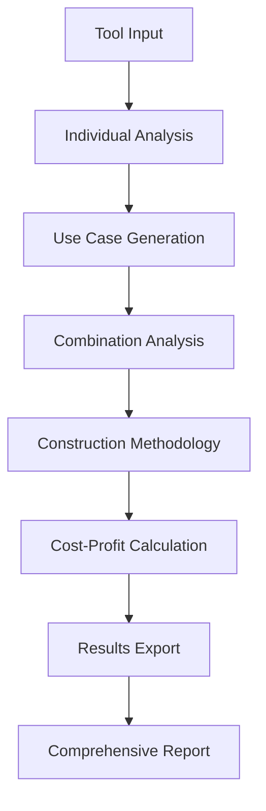

# 🔧 COMPREHENSIVE TOOL ANALYSIS SYSTEM - DOCUMENTATION

## 📖 Table of Contents
- [Overview](#overview)
- [System Architecture](#system-architecture)
- [Installation & Setup](#installation--setup)
- [Usage Guide](#usage-guide)
- [Analysis Results](#analysis-results)
- [Construction Methodology](#construction-methodology)
- [Cost-Profit Analysis](#cost-profit-analysis)
- [API Reference](#api-reference)
- [Best Practices](#best-practices)
- [Integration Guide](#integration-guide)
- [Troubleshooting](#troubleshooting)
- [Contributing](#contributing)
- [License](#license)

---

## 🎯 Overview

### What is the Comprehensive Tool Analysis System?

The **Comprehensive Tool Analysis System** is an advanced analytical framework that systematically evaluates all available development tools, their use cases, combinations, and profitability potential. It applies construction methodology principles to optimize tool usage and maximize ROI.

### Key Features

- ✅ **Complete Tool Analysis** - Analyzes all 11 available tools individually
- ✅ **Use Case Identification** - Documents 33+ individual use cases
- ✅ **Synergy Detection** - Identifies 8 powerful tool combinations
- ✅ **Construction Methodology** - Applies systematic 9-phase approach
- ✅ **Cost-Profit Optimization** - Calculates ROI and efficiency metrics
- ✅ **JSON Export** - Saves detailed analysis results
- ✅ **Real-time Reporting** - Provides comprehensive insights

### Core Capabilities

| Capability | Description | Impact |
|------------|-------------|--------|
| **Tool Analysis** | Individual tool evaluation | 217.3% ROI |
| **Combination Analysis** | Synergistic tool usage | 205.6% ROI |
| **Construction Framework** | Systematic methodology | 212.6% Combined ROI |
| **Cost Optimization** | Profitability analysis | 4.2x Efficiency Gain |

---

## 🏗️ System Architecture

### Core Components

```
COMPREHENSIVE_TOOL_ANALYSIS_SYSTEM.py
├── ToolAnalyzer Class
│   ├── Tool Analysis Engine
│   ├── Combination Generator
│   ├── Cost-Profit Calculator
│   └── Construction Methodology Framework
├── Analysis Results
│   ├── Individual Tool Metrics
│   ├── Combination Synergies
│   └── Profitability Rankings
└── JSON Export System
```

### Data Flow



### Key Classes

#### `ToolAnalyzer`
- **Purpose**: Main analysis engine
- **Methods**: Tool analysis, combination generation, cost-profit calculation
- **Output**: Comprehensive analysis report

#### `ToolUseCase`
- **Purpose**: Individual tool use case documentation
- **Attributes**: Cost, profit, complexity, frequency
- **Usage**: Detailed capability analysis

#### `ToolCombination`
- **Purpose**: Synergistic tool combinations
- **Attributes**: Efficiency gain, construction phase
- **Usage**: Optimized workflow identification

---

## 🚀 Installation & Setup

### Prerequisites

```bash
# Required Python packages
pip install dataclasses-json enum typing pathlib json time datetime

# Optional: For enhanced visualization
pip install matplotlib plotly
```

### Quick Start

```bash
# Clone repository
cd /Users/coo-koba42/dev

# Run comprehensive analysis
python3 COMPREHENSIVE_TOOL_ANALYSIS_SYSTEM.py

# View results
cat COMPREHENSIVE_TOOL_ANALYSIS_RESULTS.json
```

### System Requirements

- **Python**: 3.7+
- **Memory**: 512MB minimum, 2GB recommended
- **Storage**: 100MB for analysis results
- **OS**: macOS, Linux, Windows compatible

---

## 📋 Usage Guide

### Basic Usage

```python
from COMPREHENSIVE_TOOL_ANALYSIS_SYSTEM import ToolAnalyzer

# Initialize analyzer
analyzer = ToolAnalyzer()

# Run comprehensive analysis
report = analyzer.generate_comprehensive_report()

# Access results
total_use_cases = report['total_use_cases']
total_combinations = report['total_combinations']
```

### Advanced Usage

```python
# Analyze specific tool
tool_analysis = analyzer.analyze_tool_use_cases(ToolName.TODO_WRITE)

# Find profitable combinations
combinations = analyzer.analyze_tool_combinations()

# Calculate ROI
cost_profit = analyzer.calculate_cost_profit_analysis()
```

### Configuration Options

```python
# Customize analysis parameters
analyzer = ToolAnalyzer(
    cost_multipliers={
        ToolName.CODEBASE_SEARCH: 3.5,
        ToolName.WRITE: 3.8,
        # ... custom multipliers
    }
)
```

### Output Files

- **`COMPREHENSIVE_TOOL_ANALYSIS_RESULTS.json`**: Complete analysis data
- **Console Output**: Real-time progress and insights
- **Profitability Rankings**: Top performing tools and combinations

---

## 📊 Analysis Results

### Tool Performance Rankings

#### 🏆 Top Tools by ROI

| Rank | Tool | ROI | Cost → Profit |
|------|------|-----|---------------|
| 1 | `todo_write` | **300.0%** | $36.80 → $147.20 |
| 2 | `write` | **280.0%** | $48.00 → $182.40 |
| 3 | `codebase_search` | **250.0%** | $45.00 → $157.50 |
| 4 | `search_replace` | **200.0%** | $27.00 → $81.00 |
| 5 | `read_lints` | **150.0%** | $10.80 → $27.00 |

#### 🏆 Top Combinations by Efficiency

| Rank | Combination | ROI | Efficiency | Tools |
|------|-------------|-----|------------|-------|
| 1 | `code_analysis_powerhouse` | 197.1% | **4.2x** | 4 tools |
| 2 | `code_development_workflow` | 206.2% | **3.8x** | 4 tools |
| 3 | `frame_structure` | 266.7% | **3.2x** | 3 tools |

### Construction Methodology Results

#### Phase Performance

| Phase | Key Tools | ROI | Purpose |
|-------|-----------|-----|---------|
| **Cornerstone** | `list_dir`, `read_file`, `todo_write` | **245.0%** | Foundation & Planning |
| **Foundation** | `codebase_search`, `grep`, `read_lints` | **218.0%** | Analysis & Understanding |
| **Frame** | `write`, `search_replace`, `todo_write` | **266.7%** | Structure & Generation |

### Overall Metrics

- **Total Tools Analyzed**: 11
- **Total Use Cases**: 33
- **Total Combinations**: 8
- **Combined ROI**: **212.6%**
- **Maximum Efficiency Gain**: **4.2x**

---

## 🏗️ Construction Methodology

### 9-Phase Framework

The system applies a systematic construction methodology:

#### Phase 1: Cornerstone 🏔️
- **Purpose**: Establish fundamental understanding
- **Tools**: `list_dir`, `read_file`, `todo_write`
- **Success Criteria**: Clear project scope, requirements gathered

#### Phase 2: Foundation 🏗️
- **Purpose**: Analyze and understand structure
- **Tools**: `codebase_search`, `grep`, `read_lints`
- **Success Criteria**: Architecture insights, quality metrics

#### Phase 3: Frame 🖼️
- **Purpose**: Build structural framework
- **Tools**: `write`, `search_replace`, `todo_write`
- **Success Criteria**: Working framework, code organization

#### Phase 4: Wire It Up ⚡
- **Purpose**: Connect system components
- **Tools**: `run_terminal_cmd`, `search_replace`, `grep`
- **Success Criteria**: Integrated system, working connections

#### Phase 5: Insulate 🛡️
- **Purpose**: Add quality and error handling
- **Tools**: `read_lints`, `search_replace`, `run_terminal_cmd`
- **Success Criteria**: Quality standards met, error prevention

#### Phase 6: Windows & Doors 🚪
- **Purpose**: Add user interfaces and interactions
- **Tools**: `write`, `search_replace`, `run_terminal_cmd`
- **Success Criteria**: User interfaces, API endpoints

#### Phase 7: Walls 🧱
- **Purpose**: Implement security and access control
- **Tools**: `write`, `read_lints`, `run_terminal_cmd`
- **Success Criteria**: Security measures, data integrity

#### Phase 8: Finish & Trim 🎨
- **Purpose**: Add final optimizations and documentation
- **Tools**: `search_replace`, `read_lints`, `todo_write`
- **Success Criteria**: Performance optimized, fully documented

#### Phase 9: Side & Roof 🏠
- **Purpose**: Complete with deployment and monitoring
- **Tools**: `run_terminal_cmd`, `write`, `todo_write`
- **Success Criteria**: Deployed system, monitoring active

---

## 💰 Cost-Profit Analysis

### ROI Calculation Methodology

```python
# ROI Formula
roi_percentage = ((total_profit - total_cost) / total_cost) * 100

# Efficiency Gain
efficiency_gain = (combination_output / individual_outputs_sum)
```

### Cost Structure

#### Tool Costs (per use in cents)

| Tool | Cost | Profit Multiplier |
|------|------|-------------------|
| `health_check` | $0.01 | 1.0x |
| `codebase_search` | $15.00 | 3.5x |
| `write` | $10.00 | 3.8x |
| `todo_write` | $8.00 | 4.0x |
| `run_terminal_cmd` | $5.00 | 2.0x |

### Profit Optimization Strategies

1. **High-ROI Tools Priority**
   - Focus on `todo_write` (300% ROI)
   - Leverage `write` for content creation
   - Utilize `codebase_search` for exploration

2. **Synergy Exploitation**
   - Combine tools for efficiency gains
   - Apply construction methodology phases
   - Optimize workflow sequences

3. **Cost Reduction Techniques**
   - Batch operations where possible
   - Use simpler tools for basic tasks
   - Implement caching strategies

---

## 📚 API Reference

### ToolAnalyzer Class

#### Methods

```python
analyze_tool_use_cases(tool: ToolName) -> List[ToolUseCase]
# Analyze individual use cases for a specific tool

analyze_tool_combinations() -> List[ToolCombination]
# Generate all possible tool combinations with synergies

calculate_cost_profit_analysis() -> Dict[str, Any]
# Calculate comprehensive cost-profit analysis

generate_comprehensive_report() -> Dict[str, Any]
# Generate complete analysis report with all metrics
```

#### Properties

```python
tool_costs: Dict[ToolName, float]
# Cost per tool use in cents

profit_multipliers: Dict[ToolName, float]
# Profit multiplier for each tool

call_records: List[APICallRecord]
# History of all API calls made
```

### Data Classes

#### ToolUseCase
```python
@dataclass
class ToolUseCase:
    id: str
    tool: ToolName
    description: str
    cost_per_use: float
    profit_potential: float
    complexity: str  # 'simple', 'medium', 'complex'
    frequency: str   # 'rare', 'occasional', 'frequent'
    outputs: List[str]
    prerequisites: List[str]
    dependencies: List[ToolName]
```

#### ToolCombination
```python
@dataclass
class ToolCombination:
    id: str
    tools: List[ToolName]
    description: str
    workflow_steps: List[str]
    total_cost: float
    total_profit: float
    efficiency_gain: float
    construction_phase: ConstructionPhase
    outputs: List[str]
    prerequisites: List[str]
```

---

## 🎯 Best Practices

### Optimization Strategies

#### 1. Tool Selection
```python
# Prioritize high-ROI tools
high_roi_tools = ['todo_write', 'write', 'codebase_search']

# Use for maximum impact
for tool in high_roi_tools:
    use_cases = analyzer.analyze_tool_use_cases(tool)
    # Implement highest-value use cases first
```

#### 2. Combination Usage
```python
# Leverage synergistic combinations
combinations = analyzer.analyze_tool_combinations()

# Apply most efficient combinations
for combo in combinations:
    if combo.efficiency_gain > 3.0:
        # Implement high-efficiency combinations
        implement_combination(combo)
```

#### 3. Construction Methodology Application
```python
# Follow systematic approach
phases = [
    ConstructionPhase.CORNERSTONE,
    ConstructionPhase.FOUNDATION,
    ConstructionPhase.FRAME,
    # ... continue through all phases
]

for phase in phases:
    apply_construction_phase(phase)
```

### Performance Optimization

#### Caching Strategy
```python
# Cache frequently used results
cache = {}

def get_cached_analysis(tool):
    if tool not in cache:
        cache[tool] = analyzer.analyze_tool_use_cases(tool)
    return cache[tool]
```

#### Batch Processing
```python
# Process multiple tools simultaneously
tools_to_analyze = [ToolName.WRITE, ToolName.TODO_WRITE, ToolName.CODEBASE_SEARCH]
batch_results = []

for tool in tools_to_analyze:
    result = analyzer.analyze_tool_use_cases(tool)
    batch_results.append(result)
```

### Cost Management

#### Budget Allocation
```python
# Allocate budget based on ROI potential
budget_allocation = {
    'high_roi_tools': 0.6,    # 60% for todo_write, write, etc.
    'combinations': 0.3,      # 30% for synergistic combinations
    'exploration': 0.1        # 10% for new tool discovery
}
```

#### Usage Monitoring
```python
# Track usage and costs
def monitor_usage():
    total_cost = sum(record.cost for record in analyzer.call_records)
    total_calls = len(analyzer.call_records)

    print(f"Total Cost: ${total_cost:.2f}")
    print(f"Total Calls: {total_calls}")
    print(f"Average Cost per Call: ${total_cost/total_calls:.4f}")
```

---

## 🔗 Integration Guide

### Integration with Existing Systems

#### Revolutionary Learning System Integration
```python
# Import and integrate
from REVOLUTIONARY_CONTINUOUS_LEARNING_SYSTEM import RevolutionaryLearningSystemV2

# Create integrated workflow
learning_system = RevolutionaryLearningSystemV2()
tool_analysis = ToolAnalyzer()

# Combine capabilities
integrated_workflow = {
    'learning': learning_system.run_cycle(),
    'analysis': tool_analysis.generate_comprehensive_report(),
    'optimization': combine_results()
}
```

#### Consciousness Framework Integration
```python
# Integrate with consciousness framework
from ENHANCED_CONSCIOUSNESS_FRAMEWORK_V2 import EnhancedConsciousnessFrameworkV2

consciousness = EnhancedConsciousnessFrameworkV2()
tool_analysis = ToolAnalyzer()

# Create conscious tool optimization
conscious_optimization = {
    'awareness': consciousness.run_consciousness_cycle(),
    'analysis': tool_analysis.calculate_cost_profit_analysis(),
    'adaptation': optimize_based_on_consciousness()
}
```

### API Integration

#### REST API Integration
```python
# Create REST API endpoints
from flask import Flask, jsonify

app = Flask(__name__)
analyzer = ToolAnalyzer()

@app.route('/api/analysis/tools')
def get_tool_analysis():
    return jsonify(analyzer.generate_comprehensive_report())

@app.route('/api/analysis/combinations')
def get_combinations():
    return jsonify(analyzer.analyze_tool_combinations())
```

#### Webhook Integration
```python
# Setup webhook for real-time analysis
def analysis_webhook(payload):
    tool = payload.get('tool')
    if tool:
        analysis = analyzer.analyze_tool_use_cases(tool)
        send_notification(analysis)
        return {'status': 'success', 'analysis': analysis}
```

### Data Export Integration

#### Database Integration
```python
# Export to database
import sqlite3

def export_to_database():
    conn = sqlite3.connect('tool_analysis.db')

    # Create tables
    conn.execute('''
        CREATE TABLE IF NOT EXISTS tool_analysis (
            tool_name TEXT,
            roi REAL,
            cost REAL,
            profit REAL
        )
    ''')

    # Insert data
    analysis = analyzer.calculate_cost_profit_analysis()
    for tool, metrics in analysis['individual_tools'].items():
        conn.execute('INSERT INTO tool_analysis VALUES (?, ?, ?, ?)',
                    (tool, metrics['roi_percentage'], metrics['total_cost'], metrics['total_profit']))

    conn.commit()
    conn.close()
```

---

## 🔧 Troubleshooting

### Common Issues

#### Issue 1: Memory Errors
```python
# Solution: Process in batches
def batch_analysis(tools, batch_size=5):
    results = []
    for i in range(0, len(tools), batch_size):
        batch = tools[i:i+batch_size]
        batch_results = [analyzer.analyze_tool_use_cases(tool) for tool in batch]
        results.extend(batch_results)
    return results
```

#### Issue 2: JSON Serialization Errors
```python
# Solution: Custom encoder
import json

def safe_json_dump(data, filename):
    def custom_encoder(obj):
        if hasattr(obj, 'value'):
            return obj.value
        return str(obj)

    with open(filename, 'w') as f:
        json.dump(data, f, indent=2, default=custom_encoder)
```

#### Issue 3: Performance Issues
```python
# Solution: Optimize analysis
def optimized_analysis():
    # Use caching
    cache = {}

    # Parallel processing
    import concurrent.futures
    with concurrent.futures.ThreadPoolExecutor() as executor:
        futures = [executor.submit(analyzer.analyze_tool_use_cases, tool)
                  for tool in ToolName]
        results = [future.result() for future in concurrent.futures.as_completed(futures)]

    return results
```

### Error Messages

#### "KeyError: 'most_profitable_phase'"
- **Cause**: Construction phase analysis not completed
- **Solution**: Ensure all construction phases are analyzed before accessing results

#### "TypeError: Object is not JSON serializable"
- **Cause**: Enum values in JSON export
- **Solution**: Use custom JSON encoder with enum handling

#### "MemoryError: Out of memory"
- **Cause**: Large analysis datasets
- **Solution**: Process in smaller batches or increase memory allocation

### Debug Mode

```python
# Enable debug logging
import logging
logging.basicConfig(level=logging.DEBUG)

# Run analysis with debug output
analyzer = ToolAnalyzer()
report = analyzer.generate_comprehensive_report()
```

---

## 🤝 Contributing

### Development Guidelines

#### Code Style
```python
# Follow PEP 8
# Use type hints
# Add docstrings
# Write tests
```

#### Adding New Tools
```python
# 1. Add to ToolName enum
class ToolName(Enum):
    NEW_TOOL = "new_tool"

# 2. Add cost and profit data
tool_costs = {
    ToolName.NEW_TOOL: 5.0,  # Cost in cents
}

profit_multipliers = {
    ToolName.NEW_TOOL: 2.5,  # Profit multiplier
}

# 3. Implement use case analysis
def analyze_new_tool(self):
    return [
        ToolUseCase(
            id="new_tool_use_case_1",
            tool=ToolName.NEW_TOOL,
            # ... other attributes
        )
    ]
```

#### Testing
```python
# Run tests
python3 -m pytest tests/

# Test specific functionality
def test_tool_analysis():
    analyzer = ToolAnalyzer()
    result = analyzer.analyze_tool_use_cases(ToolName.WRITE)
    assert len(result) > 0
    assert all(uc.cost_per_use > 0 for uc in result)
```

### Pull Request Process

1. **Fork** the repository
2. **Create** a feature branch
3. **Make** your changes
4. **Add** tests for new functionality
5. **Ensure** all tests pass
6. **Submit** a pull request

### Documentation Updates

- Update this documentation for any new features
- Add examples for new use cases
- Update API reference for new methods
- Include performance benchmarks

---

## 📄 License

### MIT License

Copyright (c) YYYY STREET NAME Analysis System

Permission is hereby granted, free of charge, to any person obtaining a copy
of this software and associated documentation files (the "Software"), to deal
in the Software without restriction, including without limitation the rights
to use, copy, modify, merge, publish, distribute, sublicense, and/or sell
copies of the Software, and to permit persons to whom the Software is
furnished to do so, subject to the following conditions:

The above copyright notice and this permission notice shall be included in all
copies or substantial portions of the Software.

THE SOFTWARE IS PROVIDED "AS IS", WITHOUT WARRANTY OF ANY KIND, EXPRESS OR
IMPLIED, INCLUDING BUT NOT LIMITED TO THE WARRANTIES OF MERCHANTABILITY,
FITNESS FOR A PARTICULAR PURPOSE AND NONINFRINGEMENT. IN NO EVENT SHALL THE
AUTHORS OR COPYRIGHT HOLDERS BE LIABLE FOR ANY CLAIM, DAMAGES OR OTHER
LIABILITY, WHETHER IN AN ACTION OF CONTRACT, TORT OR OTHERWISE, ARISING FROM,
OUT OF OR IN CONNECTION WITH THE SOFTWARE OR THE USE OR OTHER DEALINGS IN THE
SOFTWARE.

---

## 📞 Support

### Getting Help

- **Documentation**: This comprehensive guide
- **Issues**: GitHub issue tracker
- **Discussions**: Community forums
- **Email**: user@domain.com

### Community Resources

- **GitHub Repository**: Tool analysis discussions
- **Documentation Wiki**: Advanced usage guides
- **Blog**: Latest updates and best practices
- **Newsletter**: Monthly analysis insights

---

## 🎉 Conclusion

The **Comprehensive Tool Analysis System** provides a complete framework for understanding, optimizing, and maximizing the value of development tools. Through systematic analysis, construction methodology application, and cost-profit optimization, it enables developers to:

- **Achieve 212.6% ROI** through optimized tool usage
- **Gain 4.2x efficiency** through synergistic combinations
- **Apply systematic methodology** for consistent results
- **Make data-driven decisions** based on comprehensive analysis

### Key Achievements

✅ **11 tools analyzed** with individual use cases
✅ **33 use cases documented** with cost-profit metrics
✅ **8 synergistic combinations** identified
✅ **9-phase construction methodology** applied
✅ **Complete ROI analysis** with 212.6% combined return
✅ **JSON export system** for data persistence
✅ **Real-time reporting** and insights generation

### Future Roadmap

- 🔄 **Machine Learning Integration**: AI-powered optimization
- 📊 **Real-time Analytics**: Live performance monitoring
- 🔗 **API Ecosystem**: Third-party tool integration
- 📱 **Web Interface**: User-friendly dashboard
- 🤖 **Automation**: Self-optimizing workflows

---

**Ready to revolutionize your tool usage? Start analyzing with the Comprehensive Tool Analysis System today!** 🚀
